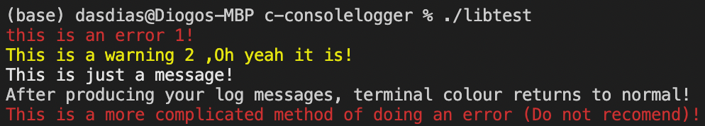

# C-ConsoleLogger

Version : 1.0

ConsoleLogger is a library written in C to allow for the quick and practical output of coloured messages to the console terminal.

## The library supports:
-  `#f03c15` - Red colour for error messages
-  `#ffea00` - Yellow colour for warning messages
-  `#ffffff` - White colour for normal, default messages

## Dependencies:
- stdio.h (standard Input/Output C library)
- string.h (standard string manipulation library)
- src/lib/c-sformat/sformat.h ( a C library written by me to provide console-silent, "printf" style formatted strings)

## Examples:
### (Code Snippet)
```C
#include "consolelogger.h"

int main(void)
{
    /* console logger constructor */
    console* logger;
    logger = console_alloc();
    
    /* log errors into console */
    console_error(logger, sformat("this is an error %d!\n", 1));
    
    /* log warnings into console */
    console_warning(logger, sformat("This is a warning %d %s! \n", 2,",Oh yeah it is"));
    
    /* log messages into console */
    console_msg(logger, "This is just a message!\n");
    
    printf("After producing your log messages, terminal colour returns to normal!\n");
    
    /* base function for console logging */
    console_log("This is a more complicated method of doing an error (Do not recomend)!\n", 
    logger->ERR_LOG, logger->DEFAULT_LOG);
    
    /* free memory - destructor */
    console_free(logger);
    //good practice
    logger = NULL;

    return 0;
}
```

### Output:
